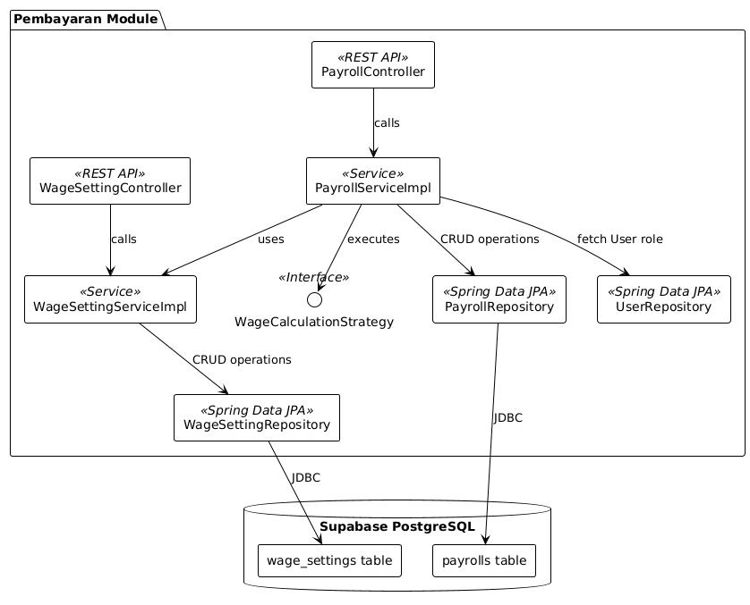

## C4 Model of the Current Architecture

### Context Diagram

### Container Diagram

### Deployment Diagram

## Future Architecture

### Future Context Diagram

### Future Container Diagram

## Risk Storming

Backend Spring Boot menjadi salah satu risiko utama karena menangani hampir seluruh proses bisnis aplikasi. Jika backend bermasalah, sebagian besar fitur dapat ikut terganggu. Mitigasinya adalah menjaga struktur backend tetap modular, menambahkan logging, health check, dan error handling agar masalah lebih mudah dideteksi dan diperbaiki.

Pada database PostgreSQL/Supabase, risikonya adalah database menjadi single source of truth. Jika database down atau schema berubah tanpa kontrol, data aplikasi bisa terganggu. Mitigasinya adalah backup rutin, penggunaan migration tool seperti Flyway atau Liquibase, serta konfigurasi akses database yang aman.

Risiko lain ada pada penyimpanan bukti foto dan monitoring sistem. Jika file tidak disimpan dengan baik, laporan kerja menjadi tidak lengkap, sementara kurangnya monitoring dapat membuat error atau penyalahgunaan akses terlambat diketahui. Mitigasinya adalah menggunakan object storage seperti Supabase Storage atau S3, membatasi akses file, serta menambahkan centralized logging, audit log, health endpoint, dan alert sederhana untuk masalah penting.

## Individual Component Diagram
Autentikasi Diagram:

Manajemen Kebun Diagram:

Manajemen Hasil Diagram: 

Manajemen Pengiriman Diagram: 

Manajemen Pembayaran Diagram: 

## Individual Code Diagram
Autentikasi Diagram:

Manajemen Kebun Diagram: 

Manajemen Hasil Diagram: 

Manajemen Pengiriman Diagram: 

Manajemen Pembayaran Diagram: 

